<div align="center">
  
</div>

# 🐱 ねこねこテクノロジー技術管理ダッシュボード

## 📋 概要

このプロジェクトは、技術資産と開発プロセスを効率的に管理・可視化するためのダッシュボードアプリケーションです。プロジェクトの進捗状況をリアルタイムで追跡し、効率的なプロジェクト管理を実現します。

## ✨ 主な機能

- 📊 プロジェクト管理
  - プロジェクトの作成・編集・削除
  - 進捗状況のリアルタイム追跡
  - ステータス管理
- 📈 プロジェクト分析
  - 進捗の可視化
  - タイムライン管理
  - リソース配分の最適化
- 🔄 リアルタイム更新
  - プロジェクト情報のリアルタイム反映
  - ステータスの即時更新

## 🚀 セットアップ

### 必要条件

- Node.js 18.x以上
- npm または yarn
- Rust 1.70.0以上
- Cargo (Rustのパッケージマネージャー)
- Git

### インストール手順

1. リポジトリのクローン:
```bash
git clone https://github.com/Sunwood-ai-labs/nekoneko-technology-management-dashboard.git
cd nekoneko-technology-management-dashboard
```

2. フロントエンドのセットアップ:
```bash
cd src/frontend
npm install
# または
yarn install
```

3. バックエンドのセットアップ:
```bash
cd ../backend
cargo build
```

4. 開発サーバーの起動:

バックエンド:
```bash
cd src/backend
cargo run
```

フロントエンド:
```bash
cd src/frontend
npm run dev
# または
yarn dev
```

アプリケーションは以下のURLでアクセスできます：
- フロントエンド: http://localhost:3001
- バックエンドAPI: http://localhost:3002

## 🔧 技術スタック

### フロントエンド
- **フレームワーク**
  - Next.js
  - React
- **言語**
  - TypeScript
- **スタイリング**
  - TailwindCSS
  - shadcn/ui
- **状態管理**
  - Zustand

### バックエンド
- **フレームワーク**
  - Axum
- **言語**
  - Rust
- **機能**
  - RESTful API
  - CORS対応
  - 非同期処理

## 🌐 API エンドポイント

- `GET /api/projects` - プロジェクト一覧の取得
- `POST /api/projects` - 新規プロジェクトの作成
- `GET /api/projects/:id` - 特定プロジェクトの取得
- `PUT /api/projects/:id` - プロジェクトの更新
- `DELETE /api/projects/:id` - プロジェクトの削除

## 📝 ライセンス

このプロジェクトはMITライセンスの下で公開されています。

## 👥 コントリビューション

プロジェクトへの貢献は大歓迎です！Issues や Pull Requests をお待ちしています。

## 📞 サポート

問題や質問がある場合は、GitHubのIssueセクションに投稿してください。
